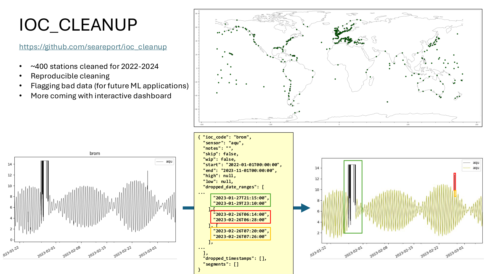
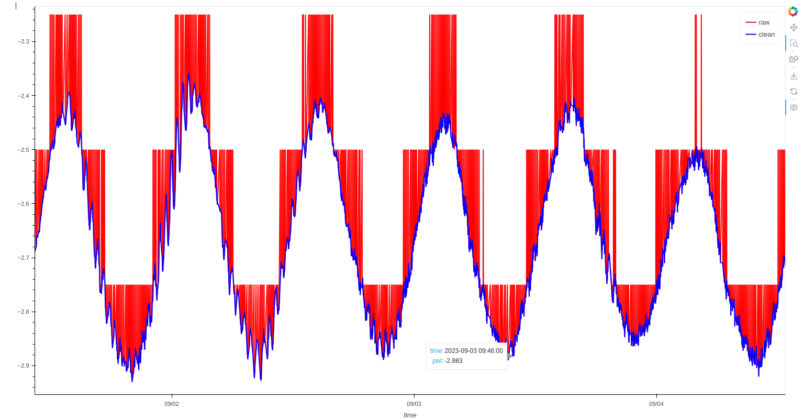

# IOC Cleanup

This repository consist a set of routines for cleaning sea level data from IOC (Intergovernmental Oceanographic Commission) stations.

The core feature of this repo are the JSON files that contain the transformation from raw data to clean signal.



## DISCLAIMERS
 1. This repository does **NOT** contain IOC station data, nor deal with the downloading of IOC data. However an example is shown in the notebook, using the `searvey` package.
 2. While this repository cleans IOC station data, the methodology could be applied to any other signal type or provider


## Getting Started
### Prerequisites
 * Python 3.11 (recommended).
 * ~15GB of free disk space for storing raw and processed data.

### Installation

```bash
git clone https://github.com/seareport/ioc_cleanup.git
pip install -r requirements.txt
```

## Usage
example with one station: `maya`
```python
station = "maya"
sensor = "pwl"
```

### Download Data:

```python
import searvey
df_raw = searvey.fetch_ioc_station(station, "2022-01-01", "2024-12-31")
```

### Clean Data:

```python
trans = C.load_transformation_from_path("../transformations/maya_pwl.json")
df_clean = C.transform(df, trans)
```


### Details
Transformation details are contained in the JSON files.
#### Example:
```json
{
  "ioc_code": "abed",
  "sensor": "bub",
  "notes": "very noisy signal",
  "skip": false,
  "wip": false,
  "start": "2022-01-01T00:00:00",
  "end": "2025-01-01T00:00:00",
  "high": null,
  "low": null,
  "dropped_date_ranges": [
    ["2022-03-27 03:00:00", "2022-03-27 03:45:00"],
    ["2023-03-26 03:00:00", "2023-03-26 03:45:00"]
  ],
  "dropped_timestamps": [
    "2022-09-30T14:45:00",
    "2022-09-30T15:30:00",
    "2022-10-02T06:45:00",
    "2022-10-02T07:00:00",
    "2023-06-21T00:15:00",
    "2024-04-24T11:00:00",
    "2024-09-07 12:00:00"
  ],
  "segments": []
}
```

### More usage

Please check notebook provided in this repo to know more about the transformations and the different flags:
 * `wip`
 * `skip`
 * `tsunami`
 * `segments`

## Contribute
Any contribution is welcome! If you'd like to improve this project, please:
 * Fork the repository.
 * Add a JSON file for a new station or modify an existing one.
 * Use the notebook provided to flag/clean the signal
 * Submit a pull request with a detailed description of your changes.

This project can be enhanced by:
 * adding more stations
 * enlarging the time window for the clean (now is only 2022-2024)
